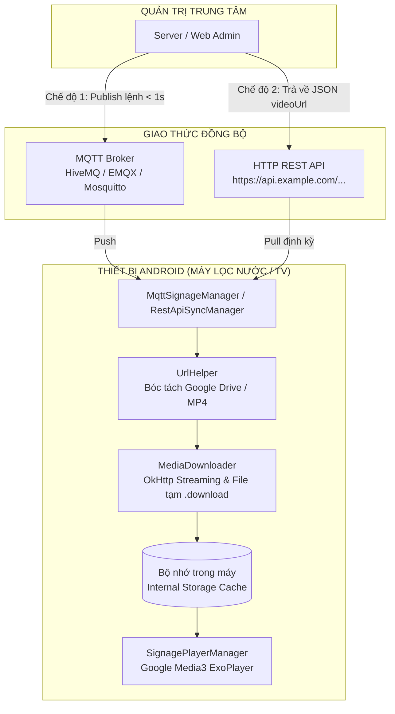

# 📺 Smart Signage Player & IoT Controller

<p align="center">
  
  
  
  
  
</p>

Ứng dụng **Trình chiếu Video Tự động 24/7 (Digital Signage & Kiosk)** được xây dựng bằng **Kotlin & Android Studio**. Ứng dụng hỗ trợ chạy đa nền tảng: **Điện thoại**, **Smart TV / Android TV Box**, **Màn hình máy tính**, và đặc biệt tối ưu để tích hợp vào **bo mạch màn hình máy** hoặc các thiết bị nhúng IoT (Rockchip, Allwinner, Raspberry Pi chạy Android).

---

## 🌟 TÍNH NĂNG NỔI BẬT

* ⚡ **Đầu vào là 1 link video**: Hỗ trợ tự động bóc tách link **Google Drive**, **Dropbox**, hoặc link file trực tiếp (`.mp4`, `.mkv`, `.webm`).
* 🔄 **Phát lặp vô tận (Continuous Loop)**: Sử dụng **Google Media3 ExoPlayer** với cơ chế giải mã phần cứng GPU mượt mà, lặp lại 24/7 không độ trễ.
* 📴 **Chạy Offline 100%**: Tự động tải dữ liệu về bộ nhớ trong máy. Khi mất mạng Wi-Fi hoặc không có Internet, ứng dụng **vẫn phát bình thường từ bộ nhớ đệm**.
* 🔌 **Khởi động cùng thiết bị (Auto Boot)**: Tích hợp `BOOT_COMPLETED`, cắm nguồn máy là ứng dụng **tự động bật và phát ngay** mà không cần thao tác tay.
* 🖥️ **Chế độ Kiosk toàn màn hình**: Ẩn hoàn toàn thanh điều hướng và thanh trạng thái (`Immersive Mode`), giữ màn hình luôn sáng (`FLAG_KEEP_SCREEN_ON`).
* 📡 **Hỗ trợ 3 chế độ kết nối Server linh hoạt**:
  1. **Server MQTT riêng**: Đổi video tức thì cho hàng ngàn máy dưới 1 giây.
  2. **Server Web REST API riêng**: Định kỳ tự động kéo link video mới từ Server web (PHP, Node.js, .NET...).
  3. **Chế độ Thủ công**: Dán 1 link cố định tại chỗ.
* 🎮 **Điều khiển thân thiện**: Hỗ trợ đầy đủ màn hình cảm ứng, chuột máy tính và **Remote TV (D-Pad)**.

---

## 🏗️ KIẾN TRÚC HỆ THỐNG



---

## 📂 CẤU TRÚC THƯ MỤC DỰ ÁN

```text
├── app/
│   ├── src/main/
│   │   ├── java/com/signage/player/
│   │   │   ├── data/
│   │   │   │   ├── MediaDownloader.kt      # Tải ngầm OkHttp & cơ chế ghi tạm .download chống hỏng file
│   │   │   │   ├── PreferencesManager.kt   # Quản lý cấu hình SharedPreferences (MQTT, API, Link)
│   │   │   │   └── UrlHelper.kt            # Nhận diện link, chặn ảnh/YouTube, bóc tách Google Drive
│   │   │   ├── mqtt/
│   │   │   │   └── MqttSignageManager.kt   # Giao thức MQTT kết nối Server, xác thực User/Pass
│   │   │   ├── player/
│   │   │   │   └── SignagePlayerManager.kt # Google Media3 ExoPlayer phát lặp 24/7
│   │   │   ├── receiver/
│   │   │   │   └── BootReceiver.kt         # Tự khởi động ứng dụng khi cắm điện bật nguồn
│   │   │   ├── server/
│   │   │   │   └── RestApiSyncManager.kt   # Quản lý đồng bộ HTTP REST API định kỳ từ Server khách
│   │   │   └── ui/
│   │   │       └── MainActivity.kt         # Điều phối Kiosk UI, bắt phím Remote TV, Fullscreen
│   │   ├── res/
│   │   │   ├── layout/
│   │   │   │   ├── activity_main.xml       # Giao diện Kiosk trình chiếu & thanh tiến độ tải
│   │   │   │   └── dialog_settings.xml     # Bảng Cài đặt 3 chế độ kết nối Server
│   │   │   └── ...
│   │   └── AndroidManifest.xml             # Khai báo Leanback TV, Boot Receiver, Fullscreen
│   └── build.gradle.kts                    # Cấu hình SDK 35, Media3, Paho MQTT, OkHttp
├── gradle/wrapper/                         # Gradle 8.7 Wrapper tương thích JDK 17 & 21
├── settings.gradle.kts                     # Cấu hình Repository (Google, MavenCentral, Eclipse)
└── README.md
```

---

## 🚀 HƯỚNG DẪN CÀI ĐẶT & BUILD DỰ ÁN

### Yêu Cầu Môi Trường
* **Android Studio**: Koala / Ladybug / Meerkat (hoặc mới hơn).
* **JDK**: OpenJDK 17 hoặc JDK 21.
* **Android SDK**: compileSdk 35, minSdk 24 (hỗ trợ từ Android 7.0 trở lên).

### Các Bước Mở Và Chạy Dự Án
1. Clone dự án về máy tính:
   ```bash
   git clone https://github.com/YOUR_USERNAME/SmartSignagePlayer.git
   ```
2. Mở **Android Studio** $\rightarrow$ Chọn **File > Open...** $\rightarrow$ Trỏ tới thư mục dự án vừa clone.
3. Bấm biểu tượng **Sync Project with Gradle Files** (con voi 🐘) để đồng bộ thư viện.
4. Bấm nút **Run (tam giác xanh)** để nạp lên Điện thoại, Smart TV hoặc máy ảo Android.

### Xuất File Cài Đặt (Build APK)
Để xuất file APK cài đặt trực tiếp lên thiết bị hoặc USB:
```powershell
.\gradlew.bat assembleDebug
```
File APK sẽ được tạo tại:
`app\build\outputs\apk\debug\app-debug.apk`

---

## 🛠️ HƯỚNG DẪN VẬN HÀNH & KẾT NỐI SERVER

### 1. Thao Tác Tại Chỗ
* **Mở Cài đặt**: Nhấn giữ màn hình cảm ứng 1 giây, hoặc bấm phím **MENU** / **BACK** trên Remote TV.
* **Xoá Cache**: Bấm nút **[Xoá bộ nhớ đệm (Clear Cache)]** để dọn sạch video cũ.

### 2. Ba Chế Độ Kết Nối Server
| Chế độ | Trường hợp áp dụng | Cách cấu hình |
| :--- | :--- | :--- |
| **1. Server MQTT riêng** | Hệ thống IoT (EMQX, Mosquitto, HiveMQ, AWS IoT...) muốn **đổi video tức thì dưới 1 giây**. | Điền địa chỉ Broker (ví dụ `tcp://mqtt.congty.com:1883`), Username, Password, và Topic. |
| **2. Server Web REST API** | Website quản trị tiêu chuẩn (PHP/Laravel, Node.js, .NET...) muốn **thiết bị tự định kỳ kéo link về**. | Điền đường dẫn API (ví dụ `https://api.congty.com/device/video`) và chu kỳ kiểm tra (phút). |
| **3. Thủ công** | Máy hoạt động độc lập, không cần Server. | Dán link Google Drive hoặc link video MP4 trực tiếp. |

### 3. Mẫu Lệnh Đổi Video Từ Backend Server Quản Trị

#### Qua MQTT (Đổi tức thì):
* **Topic chung (toàn bộ máy)**: `signage/all/video`
* **Topic riêng (từng máy theo Device ID)**: `signage/device/{DEVICE_ID}/video`
* **Ví dụ Node.js**:
  ```javascript
  const mqtt = require('mqtt');
  const client = mqtt.connect('mqtt://broker.hivemq.com:1883');
  client.publish('signage/all/video', 'https://server.com/video_moi.mp4');
  ```
* **Ví dụ Python**:
  ```python
  import paho.mqtt.client as mqtt
  client = mqtt.Client()
  client.connect("broker.hivemq.com", 1883)
  client.publish("signage/all/video", "https://server.com/video_moi.mp4")
  ```

#### Qua HTTP REST API:
Server chỉ cần trả về JSON khi thiết bị gọi tới:
```json
{
  "status": "success",
  "videoUrl": "https://server.com/video_moi.mp4"
}
```

